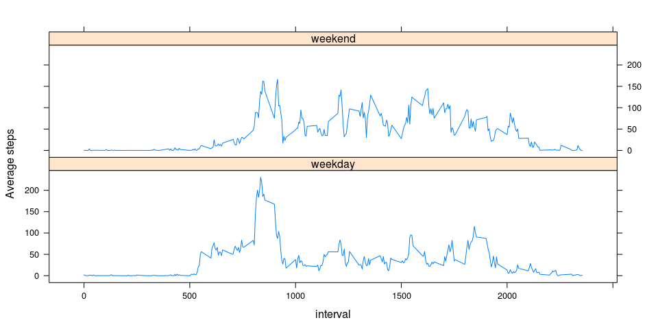

# Reproducible Research: Peer Assessment 1

## Loading and preprocessing the data

### Loading libraries 

```r
library(lubridate)
library(dplyr)
```

### Reading and preprocessing data

```r
path_to_data = unzip(file.path("./activity.zip"))
data = read.csv(path_to_data, colClasses = c("integer", "character", "integer"))
data$date = ymd(data$date)
valid_data = data[!is.na(data$steps), ]
```

## What is mean total number of steps taken per day?


```r
total_steps_by_date = group_by(valid_data, date) %>% 
  summarise(total_steps = sum(steps))

hist(total_steps_by_date$total_steps, 
     main = "Histogram showing distribution of steps taken", 
     xlab = "Total steps taken per day")
```

 


```r
steps_taken_per_day = group_by(valid_data, date) %>% 
  summarise(total_steps = sum(steps))

median_steps = median(steps_taken_per_day$total_steps)
mean_steps = mean(steps_taken_per_day$total_steps)
```
The mean and median steps taken per day is 1.0766 &times; 10<sup>4</sup> and 10765 respectively.

## What is the average daily activity pattern?


```r
mean_steps_by_interval = group_by(valid_data, interval) %>% 
  summarise(mean_steps = mean(steps))

plot(mean_steps_by_interval$interval, 
     mean_steps_by_interval$mean_steps, 
     type = "l",
     main = "Average steps over all days per 5-minute interval",
     xlab = "Interval",
     ylab = "Average steps")
```

 

```r
max_steps = max(mean_steps_by_interval$mean_steps)
```

The interval which has the highest averaged steps is 835


## Imputing missing values

Number of missing values in the data is 2304.

### Imputing Strategy
Missing values in the data will be replaced with the mean of steps at that particular interval.


```r
indices_of_NA = which(is.na(data$steps) == TRUE)
imputed_data = data

for (i in indices_of_NA) {
  imputed_data[i, "steps"] = mean_steps_by_interval[which(mean_steps_by_interval$interval == imputed_data[i, "interval"]), "mean_steps"]
}
```


```r
total_steps_by_date_imputed = group_by(imputed_data, date) %>% 
  summarise(total_steps = sum(steps))

hist(total_steps_by_date_imputed$total_steps, 
     main = "Histogram showing distribution of steps taken (with imputted data)", 
     xlab = "Total steps per day")
```

 

```r
steps_taken_per_day_imputted = group_by(imputed_data, date) %>%
  summarise(total_steps = sum(steps))

median_steps_imputted = median(steps_taken_per_day_imputted$total_steps)
mean_steps_imputted = mean(steps_taken_per_day_imputted$total_steps)
```
The mean and median steps taken per day is 10766 and 10766 respectively.

## Are there differences in activity patterns between weekdays and weekends?


```r
imputed_data = mutate(imputed_data, day_type = ifelse(weekdays(date) == "Sunday" | weekdays(date) == "Saturday", "weekend", "weekday"))
imputed_data$day_type = as.factor(imputed_data$day_type)

avg_steps = group_by(imputed_data, day_type, interval) %>% 
  summarise(avg_steps = mean(steps, na.rm = TRUE))
```


```r
library(lattice)
xyplot(avg_steps ~ interval | day_type, avg_steps, type = "l", ylab = "Average steps", layout = c(1,2))
```

 
